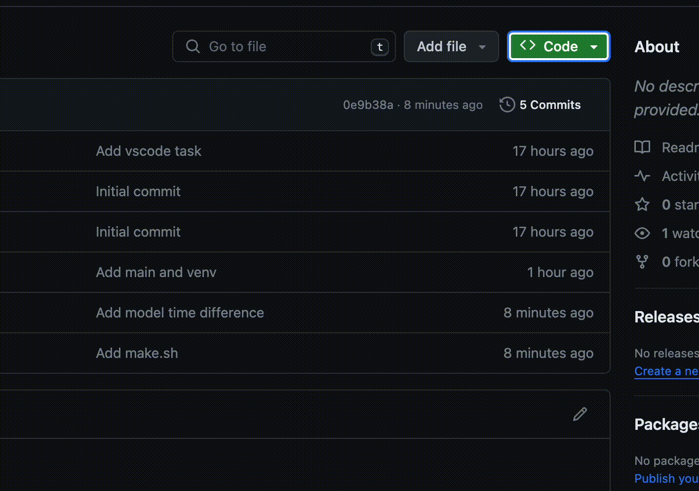
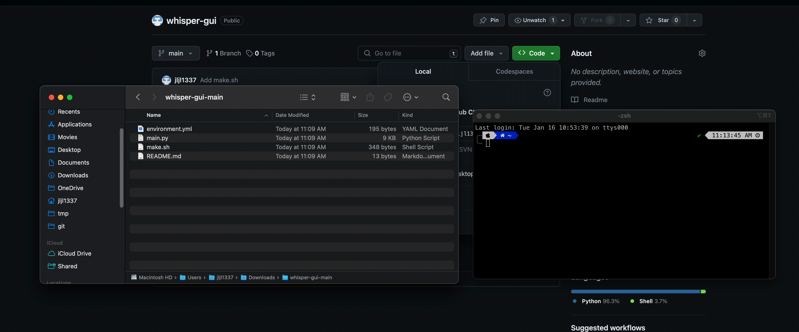
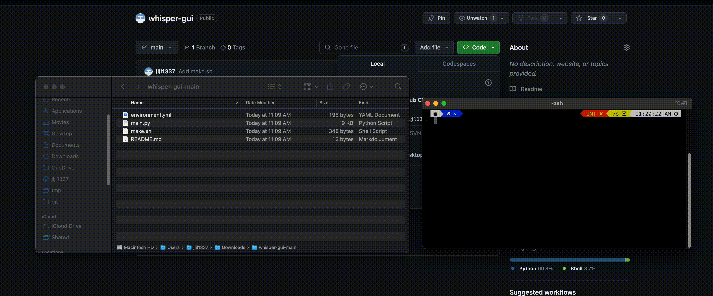

# whisper-gui

## 1. Download

Download the files:

Place the file in something like Documents or Desktop, then unzip it.

## 2. Installation

Open the terminal and the folder where you placed the files.

Type `sudo zsh ` (there is a space at the end) and drag the `make.sh` file into the terminal.

### IMPORTANT
After the installation, close the terminal and open it again.

## 3. Usage

Run `conda activate whisper-gui` to activate the environment.
Then type `python ` (there is a space at the end) and drag the `main.py` file into the terminal.

The larger the model, the longer it will take to run. A `output.txt` and a `output.srt` file will be created in the chosen folder.

### IMPORTANT
If there are `output.txt` and `output.srt` files in the folder, they will be overwritten.

## 4. SRT and other formats

The `output.srt` file is a caption file. You can upload it to YouTube or other platforms that support it.
In Final Cut Pro, you can import it as a caption file, but there are some restrictions with the format.

If you want to convert it to another format, you can use something like [this](https://crossub.xiaowude.com/srt/116) to convert the srt file into other format for Final Cut Pro.